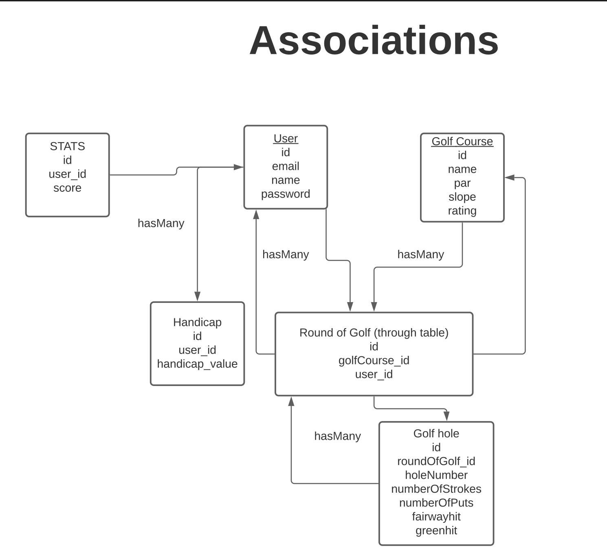

# Golf-Assistant-App

[Deployed Link](https://golfersplus.herokuapp.com/login)


[Source Code]()


## Description
   An app for golfers to keep track of scores hole by hole and per course. The dev team decided to create an app that would address both total score and quota scores for the user. There are two ways to find the score through the total score and quota. A quota normalizes the scoring making the course an even playing field for all the players to compete  against each other no matter the skill level. Additional stretch features are mapping and range estimation
## User Story

```md
A user opens the app and can sign up and create a new account or log in with credentials. Once the user is logged in they are brought to  the home page, then the users score history,  handicap value, and nav bar are displayed. The user can interact with the nav bar and click their Post Score, Stats, Golf Games
```
### Task


## Table of Contents

- [Installation](#installation)
- [Usage](#usage)
- [Database Models](#database-models)
- [Associations](#associations)
- [Seeding](#seeding)
- [Credits](#credits)
- [Badges](#badges)
- [Features](#features)
- [How to Contribute](#how-to-contribute)
- [Test](#test)
- [Code of Conduct](#contributor-covenant-code-of-conduct)
- [License](#license)

## Installation

The appropriate packages consists of

- npm i
- npm init
- npm install mysql2
- npm install doetenv
- npm install bcrypt
- npm install bootstrap
- npm install connection-session-sequelize
- npm install express
- npm install express-handlebars
- npm install express-session
- npm install nodemon
- npm install prettier
- npm install seed
- npm install sequelize
- npm install -D eslint
- npm install time-stamp (new package)


## Database Models

The database models contain the following three models, including the requirements listed for each model:

- `GolfCourse`

  - `id`

    - Integer

    - Doesn't allow null values

    - Set as primary key

    - Uses auto increment

  - `course_name`

    - String

    - Doesn't allow null values

  - `par`
    - Integer

    - Doesn't allow null values

  - `slope`
    - Integer

    - Doesn't allow null values

  - `rating`
    - Integer

    - Doesn't allow null values

- `GolfHole`

  - `id`

    - Integer.

    - Doesn't allow null values

    - Set as primary key

    - Uses auto increment

  - `holeNumber`

    - Integer

    - Doesn't allow null values

    
  - `numberOfStrokes`

    - Integer

    - Doesn't allow null values

  - `numberOfPutts`

    - Integer

    - Doesn't allow null values

  - `fairwayHit`

    - Boolean

    - Doesn't allow null values

  - `greenHit`

    - Boolean

    - Doesn't allow null values

 
- `Handicap`

  - `id`

    - Integer.

    - Doesn't allow null values.

    - Set as primary key.

    - Uses auto increment.

  - `user_id`

    - Integer.

    - References user model for id property
  
  - `user_id`

    - Integer.

    - Doesn't allow null values.
 
- `RoundOfGolf`
   - `id`

     - Integer.

     - Doesn't allow null values.

     - Set as primary key.

     - Uses auto increment.

- `Stats`
  
   - `id`

     - Integer.

     - Doesn't allow null values.

     - Set as primary key.

     - Uses auto increment.
     
    - `totalScore`

      - Integer
 
      - Doesn't allow null values

   - `totalPutts`

      - Integer
 
      - Doesn't allow null values
   
   - `totalFairway`

      - Integer
 
      - Doesn't allow null values
   
   - `totalGreen`

      - Integer
 
      - Doesn't allow null values

- `User`
     - `id`

       - Integer.

       - Doesn't allow null values.

       - Set as primary key.

       - Uses auto increment.
    
    - `name`

        - String

        - Doesn't allow null values

     - `email`
        - String

        - Doesn't allow null values

        - Unique

        - Validate

     - `password`
        - String

        - Doesn't allow null values

        - Validate


        **Hooks used to hash the password**
    
-----------------------------------------------


## Associations

 The Round of Golf is the key stone holding all the associations together. The through table in Round of Golf allows the server to render data to the ui from each hole to the user


## Seeding

-- After running the

```
 npm run seeds

```

From the command line the golf_db in mysql workbench was seeded and verified on mysql workbench.


## All CRUD operations successful with use of **GET, POST,PUT, DELETE.


## Credits

https://sqlbolt.com/lesson/select_queries_introduction

https://guides.github.com/features/mastering-markdown/

https://sequelize.org/master/manual/model-querying-finders.html

## Badges

[](https://github.com/gregpetropoulos)
[](https://github.com/gregpetropoulos)
[](https://github.com/gregpetropoulos)


## Acceptance Criteria

- [ √] Must use Node.js and Express.js to create a RESTful API

- [ √] Must have Handlebars.js as the template engine
- [ √] Must use MySQL and the Sequelize ORM for the database

- [ √] Must have GET and Post routes for retrieving new data

- [ √] Must have at least one new library, package, or technology that we haven't discussed

- [ √] Must have a folder structure that meets the MVC paradigm

- [ √] Must have authentication (express-sessions and cookies)

- [ √] Must protect API keys and sensitive information with environment variables

## Features

Use the CLI to CRUD.

## How to Contribute

Add a comment prior to contribution

## Tests

No testing on this app

## Contributor Covenant Code of Conduct

### Our Pledge

We as members, contributors, and leaders pledge to make participation in our
community a harassment-free experience for everyone, regardless of age, body
size, visible or invisible disability, ethnicity, sex characteristics, gender
identity and expression, level of experience, education, socio-economic status,
nationality, personal appearance, race, caste, color, religion, or sexual identity
and orientation.

We pledge to act and interact in ways that contribute to an open, welcoming,
diverse, inclusive, and healthy community.

## Our Standards

Examples of behavior that contributes to a positive environment for our
community include:

- Demonstrating empathy and kindness toward other people
- Being respectful of differing opinions, viewpoints, and experiences
- Giving and gracefully accepting constructive feedback
- Accepting responsibility and apologizing to those affected by our mistakes,
  and learning from the experience
- Focusing on what is best not just for us as individuals, but for the
  overall community

Examples of unacceptable behavior include:

- The use of sexualized language or imagery, and sexual attention or
  advances of any kind
- Trolling, insulting or derogatory comments, and personal or political attacks
- Public or private harassment
- Publishing others' private information, such as a physical or email
  address, without their explicit permission
- Other conduct which could reasonably be considered inappropriate in a
  professional setting

## Enforcement Responsibilities

Community leaders are responsible for clarifying and enforcing our standards of
acceptable behavior and will take appropriate and fair corrective action in
response to any behavior that they deem inappropriate, threatening, offensive,
or harmful.

Community leaders have the right and responsibility to remove, edit, or reject
comments, commits, code, wiki edits, issues, and other contributions that are
not aligned to this Code of Conduct, and will communicate reasons for moderation
decisions when appropriate.

## Scope

This Code of Conduct applies within all community spaces, and also applies when
an individual is officially representing the community in public spaces.
Examples of representing our community include using an official e-mail address,
posting via an official social media account, or acting as an appointed
representative at an online or offline event.

## Enforcement

Instances of abusive, harassing, or otherwise unacceptable behavior may be
reported to the community leaders responsible for enforcement at
[](code_of_conduct.md).
All complaints will be reviewed and investigated promptly and fairly.

All community leaders are obligated to respect the privacy and security of the
reporter of any incident.

## Enforcement Guidelines

Community leaders will follow these Community Impact Guidelines in determining
the consequences for any action they deem in violation of this Code of Conduct:

### 1. Correction

**Community Impact**: Use of inappropriate language or other behavior deemed
unprofessional or unwelcome in the community.

**Consequence**: A private, written warning from community leaders, providing
clarity around the nature of the violation and an explanation of why the
behavior was inappropriate. A public apology may be requested.

### 2. Warning

**Community Impact**: A violation through a single incident or series
of actions.

**Consequence**: A warning with consequences for continued behavior. No
interaction with the people involved, including unsolicited interaction with
those enforcing the Code of Conduct, for a specified period of time. This
includes avoiding interactions in community spaces as well as external channels
like social media. Violating these terms may lead to a temporary or
permanent ban.

### 3. Temporary Ban

**Community Impact**: A serious violation of community standards, including
sustained inappropriate behavior.

**Consequence**: A temporary ban from any sort of interaction or public
communication with the community for a specified period of time. No public or
private interaction with the people involved, including unsolicited interaction
with those enforcing the Code of Conduct, is allowed during this period.
Violating these terms may lead to a permanent ban.

### 4. Permanent Ban

**Community Impact**: Demonstrating a pattern of violation of community
standards, including sustained inappropriate behavior, harassment of an
individual, or aggression toward or disparagement of classes of individuals.

**Consequence**: A permanent ban from any sort of public interaction within
the community.

## Attribution

This Code of Conduct is adapted from the [Contributor Covenant][homepage],
version 2.0, available at
[https://www.contributor-covenant.org/version/2/0/code_of_conduct.html][v2.0].

Community Impact Guidelines were inspired by
[Mozilla's code of conduct enforcement ladder][mozilla coc].

For answers to common questions about this code of conduct, see the FAQ at
[https://www.contributor-covenant.org/faq][faq]. Translations are available
at [https://www.contributor-covenant.org/translations][translations].

[homepage]: https://www.contributor-covenant.org
[v2.0]: https://www.contributor-covenant.org/version/2/0/code_of_conduct.html
[mozilla coc]: https://github.com/mozilla/diversity
[faq]: https://www.contributor-covenant.org/faq
[translations]: https://www.contributor-covenant.org/translations

## License


Copyright (c) [2021] [Greg Petropoulos]

Permission is hereby granted, free of charge, to any person obtaining a copy
of this software and associated documentation files (the "Software"), to deal
in the Software without restriction, including without limitation the rights
to use, copy, modify, merge, publish, distribute, sublicense, and/or sell
copies of the Software, and to permit persons to whom the Software is
furnished to do so, subject to the following conditions:

The above copyright notice and this permission notice shall be included in all
copies or substantial portions of the Software.

THE SOFTWARE IS PROVIDED "AS IS", WITHOUT WARRANTY OF ANY KIND, EXPRESS OR
IMPLIED, INCLUDING BUT NOT LIMITED TO THE WARRANTIES OF MERCHANTABILITY,
FITNESS FOR A PARTICULAR PURPOSE AND NONINFRINGEMENT. IN NO EVENT SHALL THE
AUTHORS OR COPYRIGHT HOLDERS BE LIABLE FOR ANY CLAIM, DAMAGES OR OTHER
LIABILITY, WHETHER IN AN ACTION OF CONTRACT, TORT OR OTHERWISE, ARISING FROM,
OUT OF OR IN CONNECTION WITH THE SOFTWARE OR THE USE OR OTHER DEALINGS IN THE
SOFTWARE.

## Questions

### Contact:

Github: [https://github.com/gregpetropoulos](https://github.com/gregpetropoulos)

Email: <gregpetropoulos@yahoo.com>
